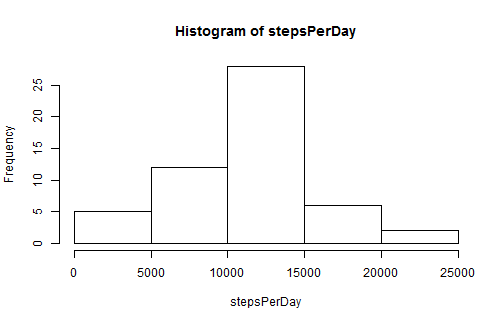
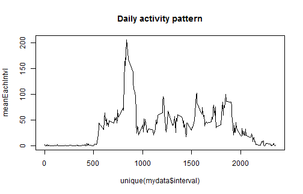
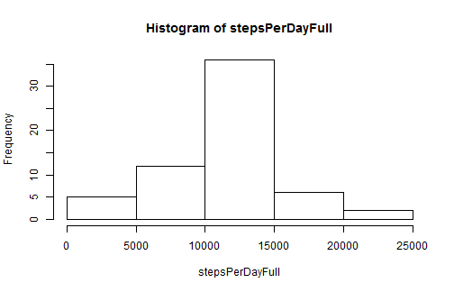
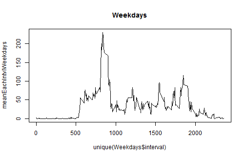
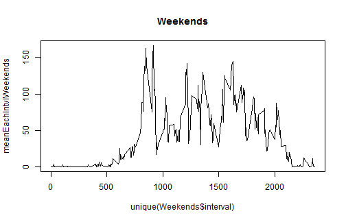

Reproducible Research -- Assignment 1
========================================================

# Loading and preprocessing the data


```r
setwd("C:/Users/Stephen/Desktop")
mydataFull <- read.csv("activity.csv")
mydata <- droplevels(mydataFull[!is.na(mydataFull$steps), ])
```


# Total number of steps per day

## Histogram


```r
stepsPerDay <- tapply(mydata$steps, mydata$date, sum)
hist(stepsPerDay)
```

 


## Mean and median of total steps per day


```r
cat("Mean of daily total steps: ", mean(stepsPerDay), "\n", sep = "")
```

```
## Mean of daily total steps: 10766
```

```r
cat("Median of daily total steps: ", median(stepsPerDay), "\n", sep = "")
```

```
## Median of daily total steps: 10765
```


# Daily activity pattern


```r
meanEachIntvl <- tapply(mydata$steps, as.factor(mydata$interval), mean)
plot(meanEachIntvl ~ unique(mydata$interval), type = "l", main = "Daily activity pattern")
```

 


# Time interval with maximum mean steps per day


```r
cat("Time interval with maximum mean steps: ", unique(mydata$interval)[which(meanEachIntvl == 
    max(meanEachIntvl))], sep = "")
```

```
## Time interval with maximum mean steps: 835
```


# Missing values

## Number of missing values


```r
cat("Number of missing values: ", sum(is.na(mydataFull$steps)), sep = "")
```

```
## Number of missing values: 2304
```


## Input missing values and re-analysis


```r
mydataMissing <- droplevels(mydataFull[is.na(mydataFull$steps), ])
mydataMissing$steps <- rep(meanEachIntvl, 8)
mydataFull <- rbind(mydataMissing, mydata)
stepsPerDayFull <- tapply(mydataFull$steps, mydataFull$date, sum)
hist(stepsPerDayFull)
```

 

```r
cat("Mean of daily total steps (inputed data): ", mean(stepsPerDayFull), "\n", 
    sep = "")
```

```
## Mean of daily total steps (inputed data): 10766
```

```r
cat("Median of daily total steps (inputed data): ", median(stepsPerDayFull), 
    "\n", sep = "")
```

```
## Median of daily total steps (inputed data): 10766
```


## Impact of inputation

Because the missing data were inputed using mean steps within a certain 5-minute interval, the inputation strategy did not affect the **mean** of daily total steps; however, the **median** of daily total steps had a tiny increase.

# Weekdays vs Weekends

## Data preparation


```r
weekday <- weekdays(as.Date(mydataFull$date), abbreviate = T)
weekday[weekday == "Sat" | weekday == "Sun"] <- "weekend"
weekday[weekday != "weekend"] <- "weekday"
mydataFull$weekday <- weekday
Weekdays <- droplevels(mydataFull[mydataFull$weekday == "weekday", ])
Weekends <- droplevels(mydataFull[mydataFull$weekday == "weekend", ])
meanEachIntvlWeekdays <- tapply(Weekdays$steps, as.factor(Weekdays$interval), 
    mean)
meanEachIntvlWeekends <- tapply(Weekends$steps, as.factor(Weekends$interval), 
    mean)
```


## Time series plots


```r
plot(meanEachIntvlWeekdays ~ unique(Weekdays$interval), type = "l", main = "Weekdays")
```

 

```r
plot(meanEachIntvlWeekends ~ unique(Weekends$interval), type = "l", main = "Weekends")
```

 

